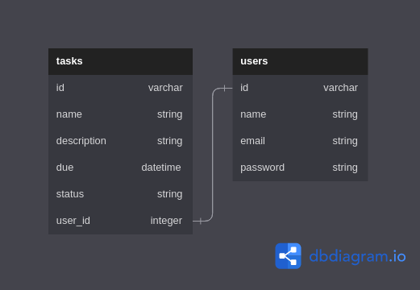

# phase-3-task-manager-project-sinatra-backend
An application that allows users to keep track of their tasks easily.

user - has many tasks

users - tasks is a one-to-many relationship.

## Entity Relationship Diagram(ERD)

This project has two tables with the tasks table having a foreign key of user_id.

- users table: Has a one-to-many relationship with the tasks table meaning one user has many tasks.

- tasks table:  Many tasks may belong to one user.

## Tools Used
This project was built with the following tools:

- [Ruby ~ v3.1.+](https://www.ruby-lang.org/en/)

Documentation on the Ruby language can be found here: [Ruby Docs](https://docs.ruby-lang.org/en/3.1/)

## Pre-requisites
In order to use this repo you need to have the following installed:

- OS [either: Windows 10+, Linux or MacOS(running on x86 or arm architecture)]
- Ruby - 3.1.+

## Installation

To use this repo on your machine requires some simple steps

### Alternative One

- Open a terminal / command line interface on your computer
- Clone the repo by using the following:

        git@github.com:Sammy-CK/phase-3-task-manager-project-sinatra-backend.git

- Be patient as it creates a copy on your local machine for you.
- Change directory to the repo folder:

        cd phase-3-task-manager-project-sinatra-backend

- (Optional) Open it in ``Visual Studio Code``

        code .

- (Alternate Option) Open it in any editor of your choice.

### Alternative Two

- On the top right corner of this page there is a button labelled ``Fork``.
- Click on that button to fork the repo to your own account.
- Take on the process in ``Alternative One`` above.
- Remember to replace your username when cloning.

        git clone https://github.com/your-username-here/phase-3-task-manager-project-sinatra-backend

# Running the application

Running the application is very straight forward. You can use the following steps to run the app.

-   Install required dependancies
        
        bundle install

-   Migrate the tables onto the database

        bundle exec rake db:migrate

-   Seed in the data from the Seed file

        bundle exec rake db:seed

-   Start the application

        bundle exec rake server

# Authors
This project was contributed to by:
- [Sammy Cherono](https://github.com/Sammy-CK/)

# License
The project is licensed under MIT